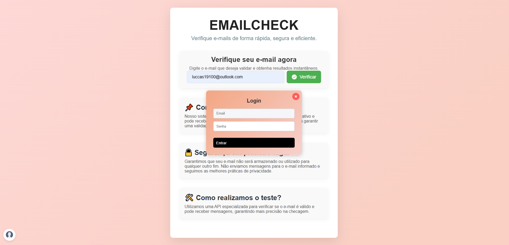
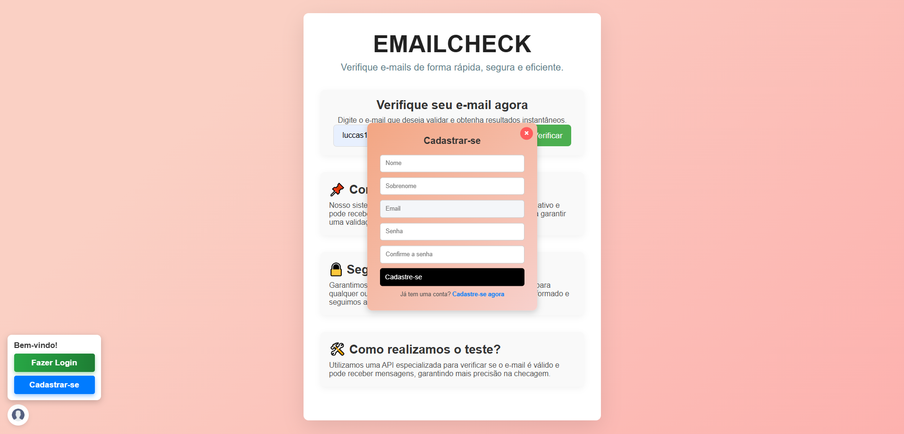
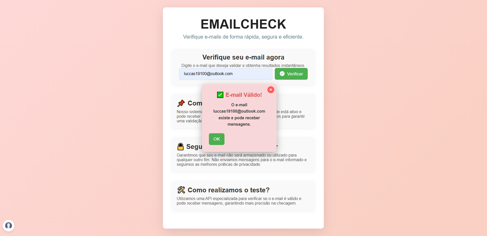
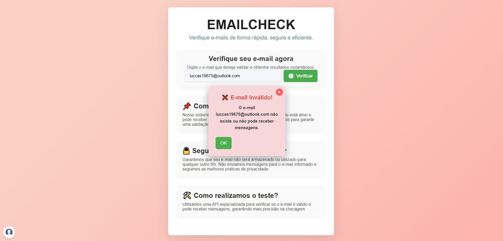

EmailCheck - Validador de E-mails com Spring Boot

📌 Sobre o Projeto

O EmailCheck é um sistema de validação de e-mails desenvolvido em Java 17+ utilizando Spring Boot. O sistema permite verificar se um e-mail é válido e pode receber mensagens consumindo uma api externa, limitando as consultas para usuários anônimos e autenticados.

🚀 Tecnologias Utilizadas

Java 17+

Spring Boot (Spring Security, Spring Data JPA, JWT)

MySQL

JWT (JSON Web Token)

API externa de verificação de e-mails

Arquitetura MVC

🏗️ Estrutura do Backend

O backend segue a arquitetura MVC (Model-View-Controller):

📂 src/main/java/com/emailcheck

├── controller   # Camada de controle (recebe requisições HTTP)

├── service      # Camada de serviço (regras de negócio)

├── repository   # Camada de acesso ao banco de dados

├── security     # Configuração de autenticação JWT

├── config       # Configurações gerais do sistema

└── model        # Representação das entidades do banco de dados

🔑 Autenticação e Controle de Acesso

O sistema implementa autenticação baseada em JWT (JSON Web Token) para diferenciar usuários anônimos e logados.

📌 Limites de Requisição:

Usuários anônimos podem realizar 3 requisições gratuitas.

Usuários autenticados podem realizar 5 requisições.

📌 Regras:

Se um usuário deslogar e logar novamente, seu limite de 5 consultas é mantido.

Se um usuário logado atingir o limite, ele deve esperar ate o token expirar(24hrs).

⚙️ Implementação

1️⃣ Verificação de E-mail com Limite de Requisições

Arquivo: EmailService.java

@Service
public class EmailService {
    private final Map<String, Integer> consultasPorUsuario = new HashMap<>();
    private int consultasAnonimas = 0;
    private static final int LIMITE_ANONIMO = 3;
    private static final int LIMITE_LOGADO = 5;

    public boolean verificarEmail(String email, String token) {
        String usuario = "anonimo";

        if (token != null && !token.isBlank()) {
            if (token.startsWith("Bearer ")) {
                token = token.substring(7);
            }
            
            if (isTokenExpired(token)) {
                return false;
            }
            usuario = extractEmail(token);
        }

        if (usuario.equals("anonimo")) {
            if (consultasAnonimas >= LIMITE_ANONIMO) {
                return false;
            }
            consultasAnonimas++;
            return true;
        }

        int consultasFeitas = consultasPorUsuario.getOrDefault(usuario, 0);
        if (consultasFeitas >= LIMITE_LOGADO) {
            return false;
        }

        consultasPorUsuario.put(usuario, consultasFeitas + 1);
        return true;
    }
}

2️⃣ Controller para Validação de E-mails

@RestController
@RequestMapping("/api/emails")
public class EmailController {
    @Autowired
    private EmailService emailService;

    @PostMapping("/validar")
    public ResponseEntity<String> validarEmail(@RequestHeader(value = "Authorization", required = false) String token,
                                               @RequestParam String email) {
        boolean valido = emailService.verificarEmail(email, token);
        if (!valido) {
            return ResponseEntity.status(HttpStatus.TOO_MANY_REQUESTS).body("Limite de consultas atingido");
        }
        return ResponseEntity.ok("E-mail válido");
    }
}

📢 Conclusão

O backend do EmailCheck foi estruturado para garantir a segurança e limitar consultas conforme a autenticação. A implementação de JWT permite que apenas usuários logados tenham um limite maior de requisições, enquanto tokens expirados são ignorados corretamente.

Com essa arquitetura, garantimos um sistema escalável e eficiente para a validação de e-mails. 🚀

# TELA DE LOGIN E CADASTRO

# EMAIL VALIDO

# EMAIL INVALIDO

